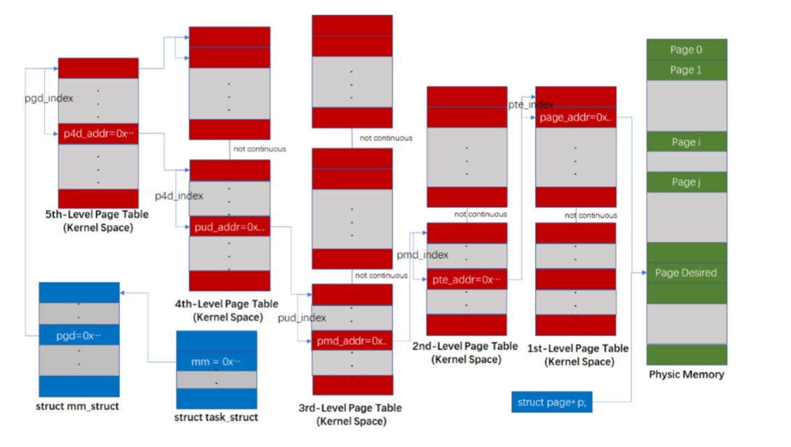

# 招生季-关于CS(面向高中毕业生的科普) V0.1

—— By Youngster38324@SJTU.CS2017

假设读者是一个高中毕业完全不懂什么是CS的盆友；

我是上海交大参与了招生的本科生，本文仅以本科生视角编写；

## 0. 什么是CS

CS := Computer Science

CSE:= Computer Science and Engineering

一般都简称CS，但实际上学的都是CSE: 科学风格的课程(数学课)和工程风格的课程(编程、系统等课程)一起学


## 1. 为什么这么火

众所周知，略写

- 互联网/信息企业挣钱多 -> 互联网所使用的技术全都基于计算机 -> 火了
- 所谓的“人工智能”的热度近年来直线上升 -> 火了


## 2. CS与人工智能的关系

一般而言，现在(2020)报专业的时候说的人工智能，指的都是CS专业的几大专业方向之一，只是因为这几年实在太热门了，所以很多学校都单独把这个小方向拿出来作为一个专业招生


## 3. CS/CSE本科到底要学什么

作为一个本科专业，我可以这样把整个本科会经历的重要内容内容分类:

- 课程
- 科研
- 实习

其中科研和实践属于这个专业最终需要培养的两种不同(风格、要求)的**生存技能**，而非学校的具体要求；学校会有一些所谓的“课程”要求去实习或者做科研，但这可以和自己的学习计划无关.

学校的要求一般都着重在课程上；一些试点班会有硬性的科研要求(例如: 上交大ACM班、上海交大ieee试点班)，也有一些院系会有硬性的实习要求（例如:上海交大软件学院大四要求去一个企业中**全职**实习四个月）

**通常而言，在没有去参与科研的时候，很难通过他人解释去理解科研是怎么回事；没有学习专业课的时候，很难理解所谓的企业中的工作(也就是互联网行业/程序员)到底是什么样** 所以我们一般会在大二大三左右主动参与了一些科研项目后大致了解高校的科研是怎么回事；或者在大二大三的时候提前做了一些工程类的项目，大致了解所谓的"程序员"到底会做一些什么事情；


### 3.1. 关于课程

大学的课程可以很明显地区分为公共课程，专业基础课程和专业课程三部分，它们对你所学的专业的影响也不一样

- 公共课程：顾名思义，代表着几乎所有专业都要学的课程，或者说所有工科/理科专业都要学的课程，比如说高等数学，线性代数就是所有理工科都要学的；比如大学英语、体育就是几乎所有专业都要学的；比如政治课全家桶就是所有中国境内大学专业都必须学的；比如作为各种力学基础的理论力学就是仅限上海交大所有工科专业都必须学习的...

- 专业基础课程：作为一个专业最最最基本的课程，就像加减乘除解方程求导之于高中数学物理、音标单词之于英语一般、元素周期表之于化学一般，在初期花很多时间和功夫去学它，但是实际上在最后你学到的东西其实是已经“融”到你的所学中去了，一般不需要思考就能够使用它们为最佳

  几乎全世界所有学校的CS专业，都会学习这些专业基础课，一般内容都是差不多的，只是大家取名会有所不同:

  - 程序设计/程序设计基础/编程/... 

    **第一门**和CS相关的课程，就学习一件事情: 编程

    编程是什么？就是和机器对话: 把你想要机器(计算机)干的事情(也就是指令)告诉计算机；但是机器比较蠢，听不懂人话，所以我们说话得特别有讲究，得有一个严格的规范，这样才能让机器知道我们要干什么；这个“说得有讲究的话”就是编程语言(其实机器并不是直接读懂编程语言的，可以看看下面编译原理的介绍)；写这个语言的过程就叫编程；

    所有CS专业的第一学期都必然会学习这件事情作为整个计算机专业的入门，一般国内计算机专业会用C语言、C++或者Java之一进行入门，其它专业的可能会用更容易上手的Python语言入门；学会一门语言以后，再入门其它相似的语言一般也就是一下午的事情；

    建议去玩一玩一个叫做"Human Resource Machine"的小游戏，那个游戏规则需要用到许多编程的基本思路...(去年貌似还出了续集)

    

  - 数据结构 / 数据结构与算法

    这是几乎所有CS专业的**第二门**和编程相关的课程; 

    一般来说，所谓计算机，可以抽象为一台给它一些数据，让它算出一些数据的机器；

    现实生活中有各种各样的数据，比如你可以把人际关系画出一张网，这就是一种数据；比如把汉字存入一本字典，这也是一种数据...

    当你学会跟机器说话了以后，你会发现机器真的很死板，尽管它真的算的很快；你需要一件新的魔法：让它对各种各样乱七八糟的数据的操作得效率更高，算得更快：比如寻找一个汉字的写法，如果词典的编写者非常懒，就随意地把汉字和读音丢到一起，让你一个个去找，那必然找到天荒地老；事实上，你的寻找方式是先锁定同一个声母的一个区域，然后锁定这个声母下的某个韵母；再在所有发这个音的字中一个一个去找；

    这就是一种储存数据的结构，它让你操作数据——也就是查找一个字更快速

    所谓数据结构就是学习近百年来公认的高效而经典的各种各样的结构，包括了它长什么样子、我怎么通过编程(这也是编程的第一次应用的尝试)来把它构建在一台计算机中...

    

    [图: AVL树，"查找树"的一种，即一种可以快速找到一个数据在哪的结构]

    

  - 离散数学/ 离散数学I/离散数学II/计算机科学的数学基础/.. :  一些藏在计算机科学背后的数学知识 

    与完全编程独立开来的一门数学课程, 一般都是把数理逻辑、集合论、图论(有些学校还会讲一点抽象代数的基础)几个学课合在一起上一两门课

    - 图论：给几个点，给某些点之间连上线，这些线还可能有长度(权重)，就成了一个"图"结构，因为这种结构在计算机中实在是到处都有用，所以就专门从纯数学的角度讲一讲: 最经典的比如，给一些点和连线及其长度，怎么去找两个点之间的最短的那一条"路"？

      

    

    ​	[图: 一个"图"(其实也是"有穷自动机"模型)]

    - 数理逻辑: 一门看上去好像和计算机无关，却又处处相关的学科；

      如果学得简单，那就只学一点符号推理，并注意到公理和定理的概念区别；所谓符号推理也就是高中的那种 如果 A 和 A->B都成立， 那么 B也成立的这种推理；只不过我们会用更数学一点的方式来表达: 比如 "if |- A  and |-  A -> B then |- B", 然后让你进行一些推理 ；

      

      [图: 一个简单的逻辑定理]

      如果学得深入一点，还会从什么叫(形式)语言、什么叫(形式)语义来讲它，可以从逻辑推理讲到有点难度的完备性定理，甚至再拓展到伟大的大多数人都看不懂的哥德尔不完备性定理...

    - 集合论: 一般就从更严谨的方式重新定义一下什么叫集合(集合论的入门书有几百页厚，不过一般计算机专业要学的大概也就几页笔记吧...)

      

      

      [图: 自然数集合有理数集基数相同的证明过程]

    - 组合数学: 对高中排列组合一个延申，主要是学习一些和组合相关的有趣的题目和定理；会跟概率论以及无穷级数有一些关联. 

      

    [图: 一个随机游走问题]

  

  ***我没有把高等数学、线性代数和概率论及数理统计列入专业基础课，但并不代表不相关**；但事实上并不是所有的CS专业方向都相关；一般而言，目前所有和所谓“人工智能”有关的专业都会用到大量的线性代数知识、概率统计知识和高等数学知识，而且高等数学和线性代数事实上还会超过本科所学的要求；

  但像例如操作系统这样的研究如何构建、优化一个庞大工程项目的方向，反而几乎不怎么用太多这些数学知识，而是需要巨量的实践和资料搜索；像信息安全这种和密码学相关的方向，还会用到例如初等数论这样的中学数学内容(到底要用哪些我也是外行了...)

  --------------

  [分割线简略表示前面的课程是后面的基础]

  - 算法/算法导论/算法引论/算法与复杂性/...: 

    计算机真的算的很快，但是再快，那它也是如果$+1s$则多算x次，那么$+10s$则也就多算了$10x$次; 学过高中数学的都知道，$2^x$ 的增长速度无比的快，那么x只要稍微大一点点，计算机再快有生之年也算不了那么多;

    所谓算法，就是研究一个和计算相关的问题，怎么让它算得更快: 正如之前的字典例子，利用一个神奇的数据结构进行计算就是一种计算方法，提高了效率；

    再举一个例子: 给你一堆乱七八糟的数，让你把它按顺序排号，应该怎么排序更快？基于这个问题，数据结构或者这门算法课或者both会专门拿一个专题来教这个问题；可以看看这个b站的视频 [9种经典排序算法可视化动画](https://www.bilibili.com/video/BV1kW411c743?from=search&seid=4518898140180984745)

  - 计算机组成/计算机系统结构/计算机组成与系统结构/计算机系统...

    作为一个计算机专业的学生，怎么能不知道自己拿来吃饭的工具到底是什么结构？这个课就是学的就是这个:

    虽然我们的电脑手机功能无限多，但实际上你拆开你的电脑，拿出那个叫做CPU的玩意看看[其实还有图形处理器GPU...]，所有的操作都是由一个一个的"把这里和那里的数字加起来，放到那个地方去"、“把那个地方的数字拿出来、放到这里来”这样的搬运工一般的操作组成 

    (有叫做递归函数理论的教材/课程会从纯数学的角度专门讲为什么这样的一个个小操作加起来就能干所有的事情)

  - 操作系统/操作系统导论/...

    虽然对于一个程序而言，它好像就是一串先干什么再干什么的指令、如果这样那么怎样的指令串，但一台电脑的CPU只有一个，你能够忍受你的手机只能运行微信吗？显然不能. 

    说白了就像人类社会一样，资源也是有限的——计算就是一种资源——同一个时刻只能有有限个计算在进行；但是即使我们一边看b站视频，一边逛着社交软件，一边干着其它事情，好像也没什么问题对吧？事实上这就是得益于操作系统的设计——它像一个政府部门一样管理着各种资源的分配——如果一个程序占用了太多的内存，那么它可能就会被系统干掉； 如果一直只计算微信需要计算的内容，那b站视频就永远卡住了...

    所谓操作系统就是**既抽象(指给你画一些框框圈圈讲讲)又具体而枯燥(指大量的源代码阅读并完成一些简单或者硬核的任务)地学习上述概念**...

    

    [图: Linux内存管理中的五级页表]

  - *编译原理: 并非所有的CS都拿它当必修课，但其实是挺重要的基础

    我们知道计算机使用二进制进行计算；然而人并不能优雅地使用二进制说话，所以人类创造了各种各样的编程语言，这样人就能更容易地看懂了这段命令到底要这个机器干什么；但是事实上机器还是只会二进制语言，所以怎么办，就得用一个“翻译官”把我写的编程语言翻译成机器读得懂的二进制程序；

    当然可能的疑问是，既然都用了翻译了，那为什么不直接把人的话翻译成机器的二进制码？这可以引出一门叫做计算理论的专业课，专门从数学的角度分析所谓符号"语言"，到底哪些是计算机能够处理的，哪些不是；注意编译器也是一个计算机里面的程序，所以它的功能也被限制在计算机的能力范围内

    

    

    [图: CompCert 编译器(C语言)的工作流程]

  

  附：一台计算机的大致软硬件结构 (未来会多次见到这样的示意图)

  ```
  人类(Humans): 快乐地编写程序、玩弄程序
  ---------------------------------------------------------------------------------
  程序(Programs): 由操作系统管理
  ---------------------------------------------------------------------------------
  操作系统(OS): 一个特殊的、巨大的程序
  _________________________________________________________________________________ 软硬件分界线
  处理器(CPU) - 由小原件组成，运行使用二进制表示的一条条指令
  ---------------------------------------------------------------------------------
  单个小元件(如寄存器、加法器)
  ---------------------------------------------------------------------------------
  非常非常非常复杂的电路
  ---------------------------------------------------------------------------------
  原子、分子、xxx
  
  
  ___________________________________________________________________________________________________________________________
  数学与逻辑: 上述设计可行性的理论依据
  ```


- 专业课： 计算机专业之大，光是小方向就能数出十来个，而在专业基础课之后的专业课，就是用来让你了解每一个专业方向的一些“细节”(打引号是因为，所谓的细节就其领域而言，不过是一个框架性质的东西，让你知道它是什么，不过冰山一角的一角的一角...) 

  我现在能够数得出来的有:

  - 人工智能: 其实并没有一个严格定义，但是目前还是很好区分的；这个领域从科研上讲更像一门实验学科，如同化学一样，需要大量的阅读前人的实验结果，然后提出一些可能的改进方案，然后大量实验看这个方案是否能够有所提高；从实践上讲可能更倾向于把已有的成果部署到现实生活中；在某乎社交平台上有数不胜数的关于这个方向的信息；

    从课程的角度，本科一般上课介绍数学原理，课下实践会把这些原理实现在计算机中；

    可以再下分一些子方向:

    - 机器学习

      顾名思义: 如何让机器学会计算一些困难的事情，比如: 给一些猫猫狗狗的照片，把它们分类为猫和狗；一般本科的这门课都是作为入门级课程来学习(一些专业还会前置一门"人工智能"来专门介绍包含机器学习在内的整个人工智能相关的大背景)

    - 自然语言处理/自然语言理解

    - 计算机视觉

  - 信息安全相关：介绍一些密码学的基本知识，比如究竟是如何做到一个人把一串信息加密后，只能由一个特定的人来进行解密; 会介绍现实应用中使用的一些经典加密技术、身份认证技术；这个方向的课程应该和信息安全专业的课程有所重合

  - 计算机网络相关: 尽管专业基础课学习了每一台机器是怎样的原理，但是那并不能把所有的机器联系起来；事实上类似于计算机系统，网络也是分了层次的，每一层为上一层提供工具：从物理世界到现实应用，一层一层往上面设计；这个方向的课程正是介绍每一层的基本原理的；

  - 计算机系统相关: 作为操作系统的延申，比如专门学习Linux操作系统的内核设计等；

  - 理论计算机

    - Track A:
      - 算法理论: 作为基础课中算法的深入，一般会教授一些更加先进的、现代的算法，例如: 引入随机数的随机算法、不要求完美的近似算法
      - 计算复杂性理论: 用计算机最短的运算时间来表达一个问题到底有多"难", 也就是说，给一个大小为n的输入，完成我想要的计算到底是要 大约$log\ n$的时间，还是$kn$的时间，还是$n^2$的时间，还是$2^n$ ； 著名的没有解决的数学问题NP=?P就来源于这个领域；课程中也当然会详细学习；
      - 可计算理论: 在计算力系统介绍中提到的，用纯数学的角度研究一个机器的数学模型为什么能够完成一系列计算、能够完成哪些计算
    - Track B: 
      - 程序语言理论：从纯数学或者偏数学的角度来建模/设计一门编程
      - 程序分析: 介绍如何对一段代码进行分析: 一个普通程序员写了一个程序，但他可能(或者一定)写得会比较~~稀~~烂，所有我们不能苛求程序员做到完美，但是我们可以对他写好的一段代码进行一个分析和修改，把一些效率不高的命令转化成效率更高的；
      - 程序验证: 研究一个程序怎样才是对的: 通常而言，程序员写出的程序一定是有bug的，在现实生活中，bug的发现与修改主要依靠测试员的大规模黑盒数据测试（俗称瞎测/瞎输入）; 但是这样测试你只能找到一小部分bug，原因是你只给出了一个又一个的个例来说服你的程序确实是对的，但也仅仅是“说服”而非证明; 那么如果是一个容不得一点错误的需求怎么办？（例如：编译器/涉及高精简仪器（航空航天）的操作系统/金融交易/… ）我们希望有一个100%没有bug的系统以及程序; 如何证明程序是正确的，就要借助数学：也就是说，我们要用数学语言描述出什么叫正确，有哪些公理/可用定理，做出一个具体的证明；然而对于一个程序我们不可能在草稿纸上就进行证明，因为人一定是会出错的，尤其是在面对程序员不知所云的程序面前；其次，程序员可能不懂数学，而数学家可能不会写程序；所以就需要一些工具，这类课程通常会了解一点这些工具的使用；

  - 软件工程

  - 数据库

  - 信息论

  - 计算机图形学

  - 数据可视化

  - 量子计算机

  - ...

  


另外放一个之前看过的一位2017级SJTU-IEEE班的盆友随手写的一篇和课程相关的公众号文章，也可见一些大学课程的体验:

- [这学期我都学了些啥？？](https://mp.weixin.qq.com/s?__biz=MzI5MjYzNzM2Mw==&mid=2247484132&idx=1&sn=46bda99c211434d3c9de94fb861ef41f&chksm=ec7f1d38db08942e1d2b51420fbe9d01fbea87f362441262da14fd2d6ece47dc74c2adb9d8d3&mpshare=1&scene=1&srcid=07274ZFxeZaMCjrPHdUJ8WW7&sharer_sharetime=1595784192915&sharer_shareid=63f56392061b512a34cdef5bd04b5160&key=2101a05471cbc5216662b11382a641c20c0900b62887ad747e826ce0d4cae5aba59d41381cb08f6c63266392f575687cd6a0933a26a26e19f6a14dbf8eedc5d61376ec521a5012e934af98bc143c424c&ascene=1&uin=MTgyMjc2NDMyOQ%3D%3D&devicetype=Windows+10+x64&version=62090529&lang=zh_CN&exportkey=Az2fY%2FmDo2PvZKGvofeJ8Ag%3D&pass_ticket=cdjjlGy8NQKKGba88rvKSWz0BHJHaE8Xr%2BqAQkn1Vnnip7lFgDLLsiRfgauVJ%2BdE)

- [跟风笑神 | 我这学期做了啥？](https://mp.weixin.qq.com/s?__biz=MzI5MjYzNzM2Mw==&mid=2247484144&idx=1&sn=10a26eee5b2b78fc1f42114005cf30f7&chksm=ec7f1d2cdb08943a2f73acc371c539f5e79143e5b5489a284d5c6a29c54ed672df4989b6c3fb&mpshare=1&scene=1&srcid=0727PKHiYkAWPKqCzvyM4ih5&sharer_sharetime=1595784214896&sharer_shareid=63f56392061b512a34cdef5bd04b5160&key=05cf80b74e2f0d3a2db97a175447e86b2cfbea882b3e245b465e70aa2edd31ef4413cc065c718d7b4e5a79b00e3f1dc942578805f2ae7c376a38ee770774dc7db49f26efdfd5227eb7f5349d9d192297&ascene=1&uin=MTgyMjc2NDMyOQ%3D%3D&devicetype=Windows+10+x64&version=62090529&lang=zh_CN&exportkey=A%2F8DVJ0V%2BiIzL%2FSuoNeizW0%3D&pass_ticket=cdjjlGy8NQKKGba88rvKSWz0BHJHaE8Xr%2BqAQkn1Vnnip7lFgDLLsiRfgauVJ%2BdE)


比较特别地，计算机专业还有另一种分类方式：科学(数学)类型的课程和工程类型的课程，从上述解释其实就已经能够看出来了；理论上这两类课都可以完全劈开了各上各的；然而，如果没有那些实践，又怎么能体会到为什么会有这样那样的有趣理论呢？


### 3.2. 关于各种各样的小工具

所谓计算机，正是一个用途广泛的工具，所以计算机专业的同学通常都是善于利用工具的；

以下工具并不会专门上课学习，但是最终我们都会学会或者多次使用它们:

- Git和Github  
- Latex和Markdown
- Linux 操作系统:
- ... (因人而异)

相关介绍可以很容易地搜索到


### 3.3. 关于科研

这个话题实在复杂...对于绝大部分高中毕业生来讲，是没法体会到它到底实在干啥的...

我从我的体验来用一句话非常抽象地介绍，基本就是找到一个问题，给它一个解决方案；或者找到一个想法，把它实现出来. 最后把你干了什么用一篇甚至几篇文章写出来，拿给同行评价看看到底合不合格.

然而作为基础都没怎么学完的大二大三本科生，怎么可能那么容易找到一个领域的那么多细节的问题呢？这时候就需要一个好老师作引路人了——告诉你他研究的领域是什么、阅读哪些资料来入门、阅读哪些论文来了解领域前沿都在干什么、作为一个本科生你到底能干什么...

作为一个普通人而言，想要参与高质量的科研，我认为一个厉害而且愿意指导你的引路人是一个无比重要的**必要不充分条件**，当然这个话题就太庞大了...

另外，不同领域的科研风格可能大相径庭，比如一个做纯理论科研的小组，他们的日常可能就是和导师在白板/草稿纸上划来划去想证明方法；一个做人工智能科研的小组，可能日常就是读海量论文，讨论想法，然后上机器实现看效果如何...


### 3.4. 关于实习与就业

这个话题实在复杂...对于绝大部分高中毕业生来讲，是没法体会到它们到底实在干啥的...

由于作者本人选择了纯粹的科研路线，所以对所有实习与就业相关的事情都不甚了解，分享两个2017级SJTU-IEEE班的盆友各自的几篇公众号文章，可以略知一二(虽然很多内容没有亲自实习过不一定明白是啥意思...)，简单了解他们这段时间(大三结束)的工作状态


盆友A：

- [我的 2020 春招实习经历与感想](https://mp.weixin.qq.com/s?__biz=MzI5MjYzNzM2Mw==&mid=2247484402&idx=1&sn=0ed063b71f051d1cd929b8ba114b76a7&chksm=ec7f1c2edb089538b486115b33663cdfa943f4437571761437a1dc226e8921ee6de1caf1fecf&mpshare=1&scene=1&srcid=0727qqff3fJEjZj3jj3UXNi5&sharer_sharetime=1595784235624&sharer_shareid=63f56392061b512a34cdef5bd04b5160&key=4f0ba211a03b4e1b6b77de0332856d18d8f94e2cae47213b7175c6dae660097061d90bef4bb77b92fbb4415548d2570031c6c815633c544864ebcac9c2cb65115893f63001228ba1db40ec938b6fb305&ascene=1&uin=MTgyMjc2NDMyOQ%3D%3D&devicetype=Windows+10+x64&version=62090529&lang=zh_CN&exportkey=Az8zg4bgCvrV2rjbOlXM2UQ%3D&pass_ticket=cdjjlGy8NQKKGba88rvKSWz0BHJHaE8Xr%2BqAQkn1Vnnip7lFgDLLsiRfgauVJ%2BdE)

盆友B：

- [2020 年，我寻找暑期实习的经历与经验](https://mp.weixin.qq.com/s/NKVI0UmzmHRY6CKW8rSwKw)
- [我为什么放弃保研，选择直接工作](https://mp.weixin.qq.com/s/nbGV51ZX5ni4IybjQZ-pPA)


## 附录: 上海交大有不少于7种CS专业

[大致信息，具体得去找招生组问]

- 上海交通大学致远学院计算机科学方向(也叫上海ACM班)

  这个学院主要靠开学前的面试才能进入，根据招生组的信息，近年应该都是由俞勇教授亲自面试选拔，**进入难度非常大**

- 上海交通大学电子信息与电气工程学院 - 计算机科学与工程系 - 计算机科学与工程专业

  这个系有如下进入方式：

  - 高考志愿填一批次电院 -> 入校分流选拔进入 (19级开始和工试一起排名选拔)
  - 高考志愿填提前批工科试点班 -> 入校分流选拔进入电院 -> 电院院内分流选拔进入
  - 高考志愿填一批次电院 -> 入校分流选拔未进入 -> 在大一下的学生自主转专业时期选拔转入
  - 高考志愿填提前批工科试点班 -> 入校分流选拔未进入电院/未进入CS -> 在大二上的工试平台内转专业时期选拔转入
  - 高考志愿填其它一批次专业 -> 入校
  - 入校后被致远学院某一专业录取 -> 中途后悔，退出 -> 转入 (具体方式未知)
  - [工试转入密西根学院/巴黎高科学院后是否能够参加转专业待考察...]
  - 考入上海交大任意专业 -> 响应征兵参军 -> 两年后退役回交大 -> 通过""任意转专业"福利转入

- 上海交通大学电子信息与电气工程学院 -  软件工程专业

  进入方式同计算机系

- 上海交通大学电子信息与电气工程学院 - 信息安全专业

  进入方式同计算机系、软件

- *上海交通大学电子信息与电气工程学院 - 自动化专业 [课程与CS有一些交集，但是还是有不少差别]

  进入方式同计算机系、软件、信安

- 上海交通大学电子信息与电气工程学院 - ieee试点班

  进入方式: 高考填志愿进入

- 人工智能专业

  2019年新开专业，待补充

- 上海交通大学-密西根学院-电子信息工程方向

  进入方式: 

  - 高考志愿一批次进入
  - 高考填写提前批工科试点班并被录取，入学前的**暑假**报名并进行面试进入

